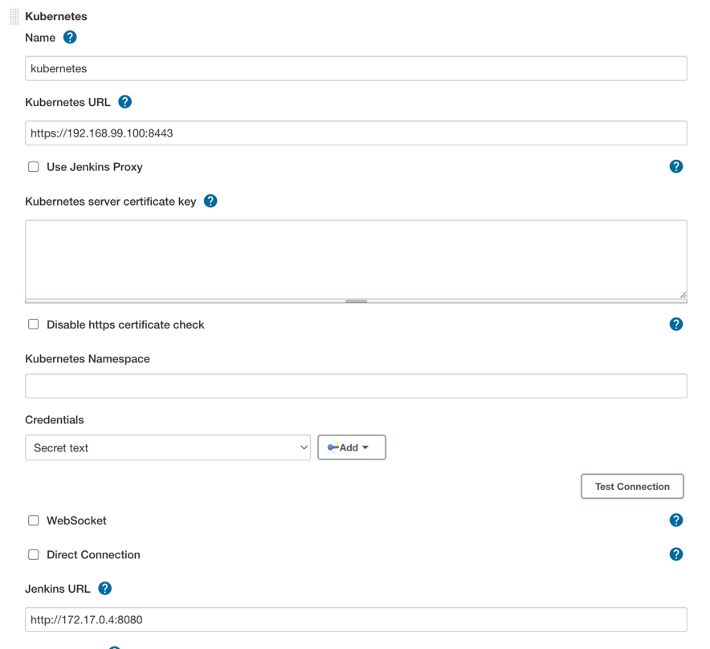
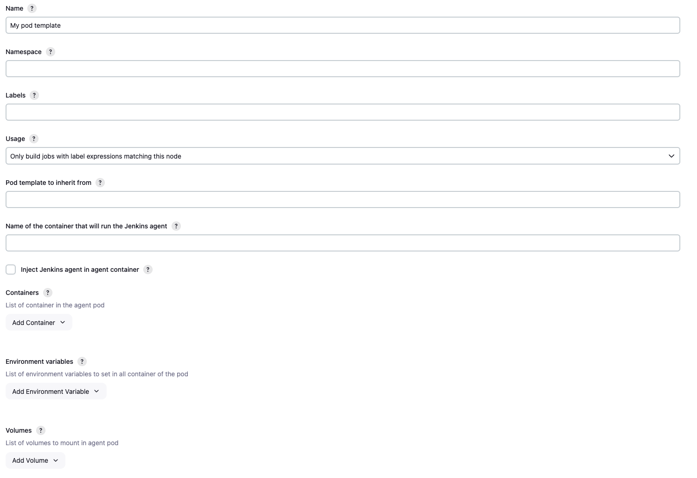

Kubernetes plugin for Jenkins
=========================

[](https://plugins.jenkins.io/kubernetes)
[](https://github.com/jenkinsci/kubernetes-plugin/releases/latest)
[](https://plugins.jenkins.io/kubernetes)

Jenkins plugin to run dynamic agents in a Kubernetes cluster.

Based on the [Scaling Docker with Kubernetes](http://www.infoq.com/articles/scaling-docker-with-kubernetes) article,
automates the scaling of Jenkins agents running in Kubernetes.

The plugin creates a Kubernetes Pod for each agent started,
defined by the Docker image to run, and stops it after each build.

Agents are launched using JNLP, so it is expected that the image connects automatically to the Jenkins master.
For that some environment variables are automatically injected:

* `JENKINS_URL`: Jenkins web interface url
* `JENKINS_SECRET`: the secret key for authentication
* `JENKINS_AGENT_NAME`: the name of the Jenkins agent
* `JENKINS_NAME`: the name of the Jenkins agent (Deprecated. Only here for backwards compatibility)

Tested with [`jenkins/inbound-agent`](https://hub.docker.com/r/jenkins/inbound-agent),
see the [Docker image source code](https://github.com/jenkinsci/docker-inbound-agent).

It is not required to run the Jenkins master inside Kubernetes. 
# Generic Setup
### Prerequisites
* A running Kubernetes cluster
* A Jenkins instance installed
* The Jenkins Kubernetes plugin installed

It should be noted that the main reason to use the global pod template definition is to migrate a huge corpus of 
existing projects (incl. freestyle) to run on Kubernetes without changing job definitions. New users setting up new 
Kubernetes builds should use the podTemplate step as shown in the example snippets [here](https://github.com/jenkinsci/kubernetes-plugin/pull/707)

Fill in the Kubernetes plugin configuration. In order to do that, you will open the Jenkins UI and navigate to 
**Manage Jenkins -> Configure System -> Cloud -> Kubernetes** and enter in the *Kubernetes URL* and *Jenkins URL*
appropriately, this is unless Jenkins is running in Kubernetes in which case the defaults work.

Supported credentials include:

* Username/password
* Secret File (kubeconfig file)
* Secret text (Token-based authentication) (OpenShift)
* Google Service Account from private key (GKE authentication)
* X.509 Client Certificate

To test this connection is successful you can use the **Test Connection** button to ensure there is
adequate communication from Jenkins to the Kubernetes cluster, as seen below



In addition to that, in the **Kubernetes Pod Template** section, we need to configure the image that will be used to 
spin up the agent pod. We do not recommend overriding the `jnlp` container except under unusual circumstances. 
for your agent, you can use the default Jenkins agent image available in [Docker Hub](https://hub.docker.com). In the 
‘Kubernetes Pod Template’ section you need to specify the following (the rest of the configuration is up to you):
Kubernetes Pod Template Name - can be any and will be shown as a prefix for unique generated agent’ names, which will 
be run automatically during builds
Docker image - the docker image name that will be used as a reference to spin up a new Jenkins agent, as seen below



# Kubernetes Cloud Configuration

In Jenkins settings click on add cloud, select `Kubernetes` and fill the information, like
_Name_, _Kubernetes URL_, _Kubernetes server certificate key_, ...

If _Kubernetes URL_ is not set, the connection options will be autoconfigured from service account or kube config file.

When running the Jenkins master outside of Kubernetes you will need to set the credential to secret text. The value of the credential will be the token of the service account you created for Jenkins in the cluster the agents will run on.

If you check **WebSocket** then agents will connect over HTTP(S) rather than the Jenkins service TCP port.
This is unnecessary when the Jenkins master runs in the same Kubernetes cluster,
but can greatly simplify setup when agents are in an external cluster
and the Jenkins master is not directly accessible (for example, it is behind a reverse proxy).
See [JEP-222](https://jenkins.io/jep/222) for more.

### Restricting what jobs can use your configured cloud

Clouds can be configured to only allow certain jobs to use them.

To enable this, in your cloud's advanced configuration check the
`Restrict pipeline support to authorized folders` box. For a job to then
use this cloud configuration you will need to add it in the jobs folder's configuration.

# Pipeline support

Nodes can be defined in a pipeline and then used, however, default execution always goes to the jnlp container.  You will need to specify the container you want to execute your task in.

*Please note the `POD_LABEL` is a new feature to automatically label the generated pod in versions `1.17.0` or higher, older versions of the Kubernetes Plugin will need to manually label the podTemplate*

This will run in jnlp container
```groovy
podTemplate {
    node(POD_LABEL) {
        stage('Run shell') {
            sh 'echo hello world'
        }
    }
}
```

This will be container specific
```groovy
podTemplate(containers: […]) {
  node(POD_LABEL) {
    stage('Run shell') {
      container('mycontainer') {
        sh 'echo hello world'
      }
    }
  }
}
```

Find more examples in the [examples dir](examples).

The default jnlp agent image used can be customized by adding it to the template

```groovy
containerTemplate(name: 'jnlp', image: 'jenkins/jnlp-slave:3.35-5-alpine', args: '${computer.jnlpmac} ${computer.name}'),
```

or with the yaml syntax

```
apiVersion: v1
kind: Pod
spec:
  containers:
  - name: jnlp
    image: 'jenkins/jnlp-slave:3.35-5-alpine'
    args: ['\$(JENKINS_SECRET)', '\$(JENKINS_NAME)']
```

### Container Group Support

Multiple containers can be defined for the agent pod, with shared resources, like mounts. Ports in each container can be accessed as in any Kubernetes pod, by using `localhost`.

The `container` statement allows to execute commands directly into each container.

```groovy
podTemplate(containers: [
    containerTemplate(name: 'maven', image: 'maven:3.3.9-jdk-8-alpine', ttyEnabled: true, command: 'cat'),
    containerTemplate(name: 'golang', image: 'golang:1.8.0', ttyEnabled: true, command: 'cat')
  ]) {

    node(POD_LABEL) {
        stage('Get a Maven project') {
            git 'https://github.com/jenkinsci/kubernetes-plugin.git'
            container('maven') {
                stage('Build a Maven project') {
                    sh 'mvn -B clean install'
                }
            }
        }

        stage('Get a Golang project') {
            git url: 'https://github.com/hashicorp/terraform.git'
            container('golang') {
                stage('Build a Go project') {
                    sh """
                    mkdir -p /go/src/github.com/hashicorp
                    ln -s `pwd` /go/src/github.com/hashicorp/terraform
                    cd /go/src/github.com/hashicorp/terraform && make core-dev
                    """
                }
            }
        }

    }
}
```


### Pod and container template configuration

The `podTemplate` is a template of a pod that will be used to create agents. It can be either configured via the user interface, or via pipeline.
Either way it provides access to the following fields:

* **cloud** The name of the cloud as defined in Jenkins settings. Defaults to `kubernetes`
* **name** The name of the pod.
* **namespace** The namespace of the pod.
* **label** The label of the pod. Can be set to a unique value to avoid conflicts across builds, or omitted and `POD_LABEL` will be defined inside the step.
* **yaml** [yaml representation of the Pod](https://kubernetes.io/docs/reference/generated/kubernetes-api/v1.10/#pod-v1-core), to allow setting any values not supported as fields
* **yamlMergeStrategy** `merge()` or `override()`. Controls whether the yaml definition overrides or is merged with the yaml definition inherited from pod templates declared with `inheritFrom`. Defaults to `override()`.
* **containers** The container templates that are use to create the containers of the pod *(see below)*.
* **serviceAccount** The service account of the pod.
* **nodeSelector** The node selector of the pod.
* **nodeUsageMode** Either 'NORMAL' or 'EXCLUSIVE', this controls whether Jenkins only schedules jobs with label expressions matching or use the node as much as possible.
* **volumes** Volumes that are defined for the pod and are mounted by **ALL** containers.
* **envVars** Environment variables that are applied to **ALL** containers.
    * **envVar** An environment variable whose value is defined inline.
    * **secretEnvVar** An environment variable whose value is derived from a Kubernetes secret.
* **imagePullSecrets** List of pull secret names, to [pull images from a private Docker registry](https://kubernetes.io/docs/tasks/configure-pod-container/pull-image-private-registry/).
* **annotations** Annotations to apply to the pod.
* **inheritFrom** List of one or more pod templates to inherit from *(more details below)*.
* **slaveConnectTimeout** Timeout in seconds for an agent to be online *(more details below)*.
* **podRetention** Controls the behavior of keeping agent pods. Can be 'never()', 'onFailure()', 'always()', or 'default()' - if empty will default to deleting the pod after `activeDeadlineSeconds` has passed.
* **activeDeadlineSeconds** If `podRetention` is set to 'never()' or 'onFailure()', pod is deleted after this deadline is passed.
* **idleMinutes** Allows the Pod to remain active for reuse until the configured number of minutes has passed since the last step was executed on it.
* **showRawYaml** Enable or disable the output of the raw Yaml file. Defaults to `true`
* **runAsUser** The user ID to run all containers in the pod as.
* **runAsGroup** The group ID to run all containers in the pod as. 
* **hostNetwork** Use the hosts network.
* **workspaceVolume** The type of volume to use for the workspace. Can be `emptyDirWorkspaceVolume` (default), `dynamicPVC()`, `hostPathWorkspaceVolume()`, `nfsWorkspaceVolume()`, or `persistentVolumeClaimWorkspaceVolume()`.

The `containerTemplate` is a template of container that will be added to the pod. Again, its configurable via the user interface or via pipeline and allows you to set the following fields:

* **name** The name of the container.
* **image** The image of the container.
* **envVars** Environment variables that are applied to the container **(supplementing and overriding env vars that are set on pod level)**.
    * **envVar** An environment variable whose value is defined inline.
    * **secretEnvVar** An environment variable whose value is derived from a Kubernetes secret.
* **command** The command the container will execute.
* **args** The arguments passed to the command.
* **ttyEnabled** Flag to mark that tty should be enabled.
* **livenessProbe** Parameters to be added to a exec liveness probe in the container (does not support httpGet liveness probes)
* **ports** Expose ports on the container.
* **alwaysPullImage** The container will pull the image upon starting.
* **runAsUser** The user ID to run the container as.
* **runAsGroup** The group ID to run the container as.

#### Specifying a different default agent connection timeout

By default, the agent connection timeout is set to 100 seconds. In some case, you would like to set a different value, if so you can set the system property `org.csanchez.jenkins.plugins.kubernetes.PodTemplate.connectionTimeout` to a different value. Please read [Features controlled by system properties](https://wiki.jenkins.io/display/JENKINS/Features+controlled+by+system+properties) page to know how to setup system properties within Jenkins.


#### Using yaml to Define Pod Templates

In order to support any possible value in Kubernetes `Pod` object, we can pass a yaml snippet that will be used as a base
for the template. If any other properties are set outside of the yaml they will take precedence.

```groovy
podTemplate(yaml: """
apiVersion: v1
kind: Pod
metadata:
  labels:
    some-label: some-label-value
spec:
  containers:
  - name: busybox
    image: busybox
    command:
    - cat
    tty: true
"""
) {
    node(POD_LABEL) {
      container('busybox') {
        sh "hostname"
      }
    }
}
```

You can use [`readFile`](https://jenkins.io/doc/pipeline/steps/workflow-basic-steps/#code-readfile-code-read-file-from-workspace) or [`readTrusted`](https://jenkins.io/doc/pipeline/steps/coding-webhook/#readtrusted-read-trusted-file-from-scm) steps to load the yaml from a file.  It is also accessible from this plugin's configuration panel in the Jenkins console.

#### Liveness Probe Usage
```groovy
containerTemplate(name: 'busybox', image: 'busybox', ttyEnabled: true, command: 'cat', livenessProbe: containerLivenessProbe( execArgs: 'some --command', initialDelaySeconds: 30, timeoutSeconds: 1, failureThreshold: 3, periodSeconds: 10, successThreshold: 1))
```
See [Defining a liveness command](https://kubernetes.io/docs/tasks/configure-pod-container/configure-liveness-readiness-probes/#defining-a-liveness-command) for more details.

### Pod template inheritance

A podTemplate may or may not inherit from an existing template. This means that the podTemplate will inherit node selector, service account, image pull secrets, containerTemplates and volumes from the template it inheritsFrom.

**yaml** is **never** merged, if is defined in the child pod template that one will be used and not the parent one.

**Service account** and **Node selector** when are overridden completely substitute any possible value found on the 'parent'.

**Container templates** that are added to the podTemplate, that has a matching containerTemplate (a containerTemplate with the same name) in the 'parent' template, will inherit the configuration of the parent containerTemplate.
If no matching containerTemplate is found, the template is added as is.

**Volume** inheritance works exactly as **Container templates**.

**Image Pull Secrets** are combined (all secrets defined both on 'parent' and 'current' template are used).

In the example below, we will inherit the podTemplate we created previously, and will just override the version of 'maven' so that it uses jdk-7 instead:

```groovy
podTemplate(label: 'anotherpod', inheritFrom: 'mypod'  containers: [
    containerTemplate(name: 'maven', image: 'maven:3.3.9-jdk-7-alpine')
  ]) {

      //Let's not repeat ourselves and ommit this part
}
```

Note that we only need to specify the things that are different. So, `ttyEnabled` and `command` are not specified, as they are inherited. Also the `golang` container will be added as is defined in the 'parent' template.

#### Multiple Pod template inheritance

Field `inheritFrom` may refer a single podTemplate or multiple separated by space. In the later case each template will be processed in the order they appear in the list *(later items overriding earlier ones)*.
In any case if the referenced template is not found it will be ignored.


#### Nesting Pod templates

Field `inheritFrom` provides an easy way to compose podTemplates that have been pre-configured. In many cases it would be useful to define and compose podTemplates directly in the pipeline using groovy.
This is made possible via nesting. You can nest multiple pod templates together in order to compose a single one.

The example below composes two different podTemplates in order to create one with maven and docker capabilities.

    podTemplate(label: 'docker', containers: [containerTemplate(image: 'docker', name: 'docker', command: 'cat', ttyEnabled: true)]) {
        podTemplate(label: 'maven', containers: [containerTemplate(image: 'maven', name: 'maven', command: 'cat', ttyEnabled: true)]) {
            // do stuff
        }
    }

This feature is extra useful, pipeline library developers as it allows you to wrap podTemplates into functions and let users, nest those functions according to their needs.

For example one could create functions for their podTemplates and import them for use.
Say here's our file `src/com/foo/utils/PodTemplates.groovy`:
```groovy
package com.foo.utils

public void dockerTemplate(body) {
  podTemplate(
        containers: [containerTemplate(name: 'docker', image: 'docker', command: 'cat', ttyEnabled: true)],
        volumes: [hostPathVolume(hostPath: '/var/run/docker.sock', mountPath: '/var/run/docker.sock')]) {
    body.call()
}
}

public void mavenTemplate(body) {
  podTemplate(
        containers: [containerTemplate(name: 'maven', image: 'maven', command: 'cat', ttyEnabled: true)],
        volumes: [secretVolume(secretName: 'maven-settings', mountPath: '/root/.m2'),
                  persistentVolumeClaim(claimName: 'maven-local-repo', mountPath: '/root/.m2nrepo')]) {
    body.call()
}
}

return this
```

Then consumers of the library could just express the need for a maven pod with docker capabilities by combining the two, however once again, you will need to express the specific container you wish to execute commands in.  You can **NOT** omit the `node` statement.

Note that `POD_LABEL` will be the innermost generated label so as to get a node which has all the outer pods available on the node, as shown in this example:

```groovy
import com.foo.utils.PodTemplates

slaveTemplates = new PodTemplates()

slaveTemplates.dockerTemplate {
  slaveTemplates.mavenTemplate {
    node(POD_LABEL) {
      container('docker') {
        sh 'echo hello from docker'
      }
      container('maven') {
        sh 'echo hello from maven'
      }
     }
  }
}
```

There are cases where this implicit inheritance via nested declaration is not wanted or another explicit inheritance is preferred.
In this case, use `inheritFrom ''` to remove any inheritance, or `inheritFrom 'otherParent'` to override it.

#### Using a different namespace

There might be cases, where you need to have the agent pod run inside a different namespace than the one configured with the cloud definition.
For example you may need the agent to run inside an `ephemeral` namespace for the sake of testing.
For those cases you can explicitly configure a namespace either using the ui or the pipeline.

## Container Configuration
When configuring a container in a pipeline podTemplate the following options are available:

```groovy
podTemplate(cloud: 'kubernetes', containers: [
    containerTemplate(
        name: 'mariadb',
        image: 'mariadb:10.1',
        ttyEnabled: true,
        privileged: false,
        alwaysPullImage: false,
        workingDir: '/home/jenkins/agent',
        resourceRequestCpu: '50m',
        resourceLimitCpu: '100m',
        resourceRequestMemory: '100Mi',
        resourceLimitMemory: '200Mi',
        envVars: [
            envVar(key: 'MYSQL_ALLOW_EMPTY_PASSWORD', value: 'true'),
            secretEnvVar(key: 'MYSQL_PASSWORD', secretName: 'mysql-secret', secretKey: 'password'),
            ...
        ],
        ports: [portMapping(name: 'mysql', containerPort: 3306, hostPort: 3306)]
    ),
    ...
],
volumes: [
    emptyDirVolume(mountPath: '/etc/mount1', memory: false),
    secretVolume(mountPath: '/etc/mount2', secretName: 'my-secret'),
    configMapVolume(mountPath: '/etc/mount3', configMapName: 'my-config'),
    hostPathVolume(mountPath: '/etc/mount4', hostPath: '/mnt/my-mount'),
    nfsVolume(mountPath: '/etc/mount5', serverAddress: '127.0.0.1', serverPath: '/', readOnly: true),
    persistentVolumeClaim(mountPath: '/etc/mount6', claimName: 'myClaim', readOnly: true)
],
imagePullSecrets: [ 'pull-secret' ],
annotations: [
    podAnnotation(key: "my-key", value: "my-value")
    ...
]) {
   ...
}

```

## Declarative Pipeline

Declarative Pipeline support requires Jenkins 2.66+

Declarative agents can be defined from yaml

```groovy
pipeline {
  agent {
    kubernetes {
      yaml """
apiVersion: v1
kind: Pod
metadata:
  labels:
    some-label: some-label-value
spec:
  containers:
  - name: maven
    image: maven:alpine
    command:
    - cat
    tty: true
  - name: busybox
    image: busybox
    command:
    - cat
    tty: true
"""
    }
  }
  stages {
    stage('Run maven') {
      steps {
        container('maven') {
          sh 'mvn -version'
        }
        container('busybox') {
          sh '/bin/busybox'
        }
      }
    }
  }
}
```

or using `yamlFile` to keep the pod template in a separate `KubernetesPod.yaml` file

```
pipeline {
  agent {
    kubernetes {
      yamlFile 'KubernetesPod.yaml'
    }
  }
  stages {
      ...
  }
}
```

Note that it was previously possible to define `containerTemplate` but that has been deprecated in favor of the yaml format.

```groovy
pipeline {
  agent {
    kubernetes {
      //cloud 'kubernetes'
      containerTemplate {
        name 'maven'
        image 'maven:3.3.9-jdk-8-alpine'
        ttyEnabled true
        command 'cat'
      }
    }
  }
  stages { ... }
}
```

Run the Pipeline or individual stage within a custom workspace - not required unless explicitly stated.

```
pipeline {
  agent {
    kubernetes {
      customWorkspace 'some/other/path'
      defaultContainer 'maven'
      yamlFile 'KubernetesPod.yaml'
    }
  }

  stages {
    stage('Run maven') {
      steps {
        sh 'mvn -version'
        sh "echo Workspace dir is ${pwd()}"
      }
    }
  }
}
```

### Default inheritance
Unlike scripted k8s template, declarative templates do not inherit from parent template. You need to explicitly declare the inheritance if necessary.
In the following example, `nested-pod` will only contain the `maven` container.
```groovy
pipeline {
  agent {
    kubernetes {
      label 'parent-pod'
      yaml """
spec:
  containers:
  - name: golang
    image: golang:1.6.3-alpine
    command:
    - cat
    tty: true
"""
    }
  }
  stages {
    stage('Run maven') {
        agent {
            kubernetes {
                label 'nested-pod'
                yaml """
spec:
  containers:
  - name: maven
    image: maven:3.3.9-jdk-8-alpine
    command:
    - cat
    tty: true
"""
            }
        }
      steps {
        ...
      }
    }
  }
}

```

## Accessing container logs from the pipeline

If you use the `containerTemplate` to run some service in the background
(e.g. a database for your integration tests), you might want to access its log from the pipeline.
This can be done with the `containerLog` step, which prints the log of the
requested container to the build log.

#### Required Parameters
* **name** the name of the container to get logs from, as defined in `podTemplate`. Parameter name
can be omitted in simple usage:

```groovy
containerLog 'mongodb'
```

#### Optional Parameters
* **returnLog** return the log instead of printing it to the build log (default: `false`)
* **tailingLines** only return the last n lines of the log (optional)
* **sinceSeconds** only return the last n seconds of the log (optional)
* **limitBytes** limit output to n bytes (from the beginning of the log, not exact).

Also see the online help and [examples/containerLog.groovy](examples/containerLog.groovy).

# Running on OpenShift

OpenShift runs containers using a 'random' UID that is overriding what is specified in Docker images.
For this reason, you may end up with the following warning in your build

```
[WARNING] HOME is set to / in the jnlp container. You may encounter troubles when using tools or ssh client. This usually happens if the uid doesnt have any entry in /etc/passwd. Please add a user to your Dockerfile or set the HOME environment variable to a valid directory in the pod template definition.
```

At the moment the jenkinsci agent image is not built for OpenShift and will issue this warning.

This issue can be circumvented in various ways:
* build a docker image for OpenShift in order to behave when running using an arbitrary uid.
* override HOME environment variable in the pod spec to use `/home/jenkins` and mount a volume to `/home/jenkins` to ensure the user running the container can write to it

See this [example](examples/openshift-home-yaml.groovy) configuration.

# Windows support

You can run pods on Windows if your cluster has Windows nodes.
See the [example](examples/windows.groovy).

# Constraints

Multiple containers can be defined in a pod.
One of them is automatically created with name `jnlp`, and runs the Jenkins JNLP agent service, with args `${computer.jnlpmac} ${computer.name}`,
and will be the container acting as Jenkins agent.

Other containers must run a long running process, so the container does not exit. If the default entrypoint or command
just runs something and exit then it should be overridden with something like `cat` with `ttyEnabled: true`.

**WARNING**
If you want to provide your own Docker image for the JNLP agent, you **must** name the container `jnlp` so it overrides the default one. Failing to do so will result in two agents trying to concurrently connect to the master.


# No delay provisioning

By default, Jenkins estimates load to avoid over-provisioning cloud nodes.
This plugin will use its own provisioning strategy by default. With this strategy, a new node is created on Kubernetes as soon as NodeProvisioner detects a need for more agents.
In worst case scenarios, this will result in some extra nodes being provisioned on Kubernetes, which will be shortly terminated.

If you want to turn off this Strategy you can set SystemProperty `io.jenkins.plugins.kubernetes.disableNoDelayProvisioning=true`

# Configuration on minikube

Create and start [minikube](https://github.com/kubernetes/minikube)

The client certificate needs to be converted to PKCS, will need a password

    openssl pkcs12 -export -out ~/.minikube/minikube.pfx -inkey ~/.minikube/apiserver.key -in ~/.minikube/apiserver.crt -certfile ~/.minikube/ca.crt -passout pass:secret

Validate that the certificates work

    curl --cacert ~/.minikube/ca.crt --cert ~/.minikube/minikube.pfx:secret --cert-type P12 https://$(minikube ip):8443

Add a Jenkins credential of type certificate, upload it from `~/.minikube/minikube.pfx`, password `secret`

Fill *Kubernetes server certificate key* with the contents of `~/.minikube/ca.crt`


# Configuration on Google Container Engine

Create a cluster

    gcloud container clusters create jenkins --num-nodes 1 --machine-type g1-small

and note the admin password and server certificate.

Or use Google Developer Console to create a Container Engine cluster, then run

    gcloud container clusters get-credentials jenkins
    kubectl config view --raw

the last command will output kubernetes cluster configuration including API server URL, admin password and root certificate


# Debugging

First watch if the Jenkins agent pods are started.
Make sure you are in the correct cluster and namespace.

    kubectl get -a pods --watch

If they are in a different state than `Running`, use `describe` to get the events

    kubectl describe pods/my-jenkins-agent

If they are `Running`, use `logs` to get the log output

    kubectl logs -f pods/my-jenkins-agent jnlp

If pods are not started or for any other error, check the logs on the master side.

For more detail, configure a new [Jenkins log recorder](https://wiki.jenkins-ci.org/display/JENKINS/Logging) for
`org.csanchez.jenkins.plugins.kubernetes` at `ALL` level.

To inspect the json messages sent back and forth to the Kubernetes API server you can configure
a new [Jenkins log recorder](https://wiki.jenkins-ci.org/display/JENKINS/Logging) for `okhttp3`
at `DEBUG` level.

## Deleting pods in bad state

    kubectl get pods -o name --selector=jenkins=slave --all-namespaces  | xargs -I {} kubectl delete {}

# Building and Testing

Integration tests will use the currently configured context autodetected from kube config file or service account.

## Manual Testing

Run `mvn clean install` and copy `target/kubernetes.hpi` to Jenkins plugins folder.

## Running Kubernetes Integration Tests

Please note that the system you run `mvn` on needs to be reachable from the cluster.
If you see the agents happen to connect to the wrong host, see you can use
`jenkins.host.address` as mentioned above.

### Integration Tests with Minikube

For integration tests install and start [minikube](https://github.com/kubernetes/minikube).
Tests will detect it and run a set of integration tests in a new namespace.

Some integration tests run a local jenkins, so the host that runs them needs
to be accessible from the kubernetes cluster.
By default Jenkins will listen on `192.168.64.1` interface only, for security reasons.
If your minikube is not running in that network, pass `connectorHost` to maven, ie.

    mvn clean install -DconnectorHost=$(minikube ip | sed -e 's/\([0-9]*\.[0-9]*\.[0-9]*\).*/\1.1/')

If you don't mind others in your network being able to use your test jenkins you could just use this:

    mvn clean install -DconnectorHost=0.0.0.0

Then your test jenkins will listen on all ip addresses so that the build pods will be able to connect from the pods in your minikube VM to your host.  

If your minikube is running in a VM (e.g. on virtualbox) and the host running `mvn`
does not have a public hostname for the VM to access, you can set the `jenkins.host.address`
system property to the (host-only or NAT) IP of your host:

    mvn clean install -Djenkins.host.address=192.168.99.1

### Integration Tests with Microk8s

If [Microk8s](https://microk8s.io/) is running and is the default context in your `~/.kube/config`,
just run as

    mvn clean install -Pmicrok8s

This assumes that from a pod, the host system is accessible as IP address `10.1.1.1`.
It might be some variant such as `10.1.37.1`,
in which case you would need to set `-DconnectorHost=… -Djenkins.host.address=…` instead.
To see the actual address, try:

```bash
ifdata -pa cni0
```

Or to verify the networking inside a pod:

```bash
kubectl run --rm --image=praqma/network-multitool --restart=Never --attach sh ip route | fgrep 'default via'
```

### Integration Tests in a Different Cluster

Try

```bash
bash test-in-k8s.sh
```

# Docker image

Docker image for Jenkins, with plugin installed.
Based on the [official image](https://registry.hub.docker.com/_/jenkins/).

## Running the Docker image

    docker run --rm --name jenkins -p 8080:8080 -p 50000:50000 -v /var/jenkins_home csanchez/jenkins-kubernetes


# Running in Kubernetes

The example configuration will create a stateful set running Jenkins with persistent volume
and using a service account to authenticate to Kubernetes API.

## Running locally with minikube

A local testing cluster with one node can be created with [minikube](https://github.com/kubernetes/minikube)

    minikube start

You may need to set the correct permissions for host mounted volumes

    minikube ssh
    sudo chown 1000:1000 /tmp/hostpath-provisioner/pvc-*

Then create the Jenkins namespace, controller and Service with

    kubectl create namespace kubernetes-plugin
    kubectl config set-context $(kubectl config current-context) --namespace=kubernetes-plugin
    kubectl create -f src/main/kubernetes/service-account.yml
    kubectl create -f src/main/kubernetes/jenkins.yml

Get the url to connect to with

    minikube service jenkins --namespace kubernetes-plugin --url

## Running in Google Container Engine GKE

Assuming you created a Kubernetes cluster named `jenkins` this is how to run both Jenkins and agents there.

Creating all the elements and setting the default namespace

    kubectl create namespace kubernetes-plugin
    kubectl config set-context $(kubectl config current-context) --namespace=kubernetes-plugin
    kubectl create -f src/main/kubernetes/service-account.yml
    kubectl create -f src/main/kubernetes/jenkins.yml

Connect to the ip of the network load balancer created by Kubernetes, port 80.
Get the ip (in this case `104.197.19.100`) with `kubectl describe services/jenkins`
(it may take a bit to populate)

    $ kubectl describe services/jenkins
    Name:           jenkins
    Namespace:      default
    Labels:         <none>
    Selector:       name=jenkins
    Type:           LoadBalancer
    IP:         10.175.244.232
    LoadBalancer Ingress:   104.197.19.100
    Port:           http    80/TCP
    NodePort:       http    30080/TCP
    Endpoints:      10.172.1.5:8080
    Port:           agent   50000/TCP
    NodePort:       agent   32081/TCP
    Endpoints:      10.172.1.5:50000
    Session Affinity:   None
    No events.

Until Kubernetes 1.4 removes the SNATing of source ips, seems that CSRF (enabled by default in Jenkins 2)
needs to be configured to avoid `WARNING: No valid crumb was included in request` errors.
This can be done checking _Enable proxy compatibility_ under Manage Jenkins -> Configure Global Security

Configure Jenkins, adding the `Kubernetes` cloud under configuration, setting
Kubernetes URL to the container engine cluster endpoint or simply `https://kubernetes.default.svc.cluster.local`.
Under credentials, click `Add` and select `Kubernetes Service Account`,
or alternatively use the Kubernetes API username and password. Select 'Certificate' as credentials type if the
kubernetes cluster is configured to use client certificates for authentication.

Using `Kubernetes Service Account` will cause the plugin to use the default token mounted inside the Jenkins pod. See [Configure Service Accounts for Pods](https://kubernetes.io/docs/tasks/configure-pod-container/configure-service-account/) for more information.


You may want to set `Jenkins URL` to the internal service IP, `http://10.175.244.232` in this case,
to connect through the internal network.

Set `Container Cap` to a reasonable number for tests, i.e. 3.

Add an image with

* Docker image: `jenkins/inbound-agent`
* Jenkins agent root directory: `/home/jenkins/agent`


Now it is ready to be used.

Tearing it down

    kubectl delete namespace/kubernetes-plugin


## Customizing the deployment

### Modify CPUs and memory request/limits (Kubernetes Resource API)

Modify file `./src/main/kubernetes/jenkins.yml` with desired limits

```yaml
resources:
      limits:
        cpu: 1
        memory: 1Gi
      requests:
        cpu: 0.5
        memory: 500Mi
```

Note: the JVM will use the memory `requests` as the heap limit (-Xmx)

## Building

    docker build -t csanchez/jenkins-kubernetes .
 
# Related Projects

* [Kubernetes Pipeline plugin](https://github.com/jenkinsci/kubernetes-pipeline-plugin): pipeline extension to provide native support for using Kubernetes pods, secrets and volumes to perform builds
* [kubernetes-credentials](https://github.com/jenkinsci/kubernetes-credentials-plugin): Credentials provider that reads Kubernetes secrets
