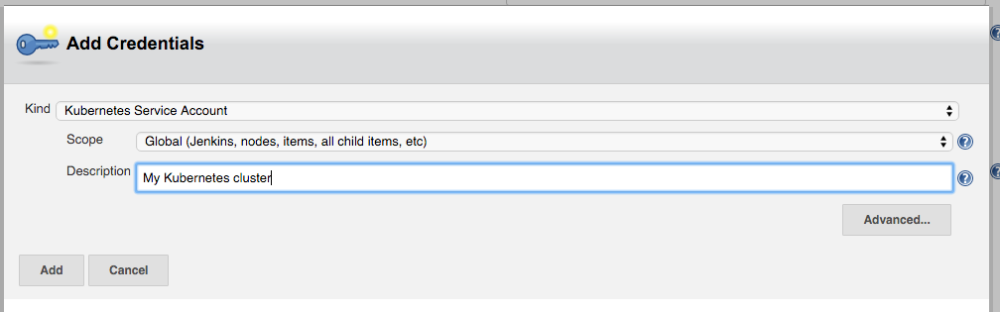
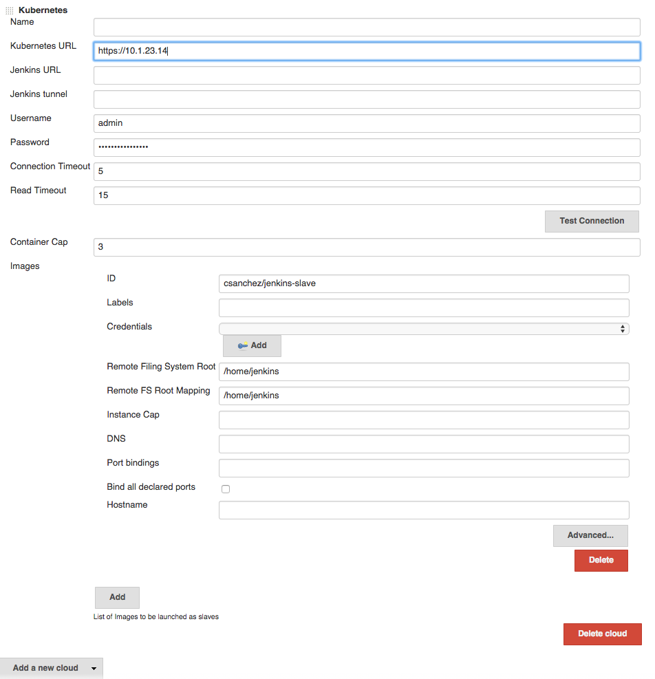

jenkins-kubernetes-plugin
=========================

Jenkins plugin to run dynamic slaves in a Kubernetes/Docker environment.

Based on the [Scaling Docker with Kubernetes](http://www.infoq.com/articles/scaling-docker-with-kubernetes) article,
automates the scaling of Jenkins slaves running in Kubernetes.

The plugin creates a Kubernetes Pod for each slave started,
defined by the Docker image to run, and stops it after each build.

Slaves are launched using JNLP, so it is expected that the image connects automatically to the Jenkins master.
For that some environment variables are automatically injected:

* `JENKINS_URL`: Jenkins web interface url
* `JENKINS_JNLP_URL`: url for the jnlp definition of the specific slave
* `JENKINS_SECRET`: the secret key for authentication
* `JENKINS_NAME`: the name of the Jenkins agent

Tested with [`jenkinsci/jnlp-slave`](https://hub.docker.com/r/jenkinsci/jnlp-slave),
see the [Docker image source code](https://github.com/carlossg/jenkins-slave-docker).


# Pipeline support

Nodes can be defined in a pipeline and then used

```groovy
podTemplate(label: 'mypod', containers: [
    containerTemplate(name: 'maven', image: 'maven:3.3.9-jdk-8-alpine', ttyEnabled: true, command: 'cat'),
    containerTemplate(name: 'golang', image: 'golang:1.6.3', ttyEnabled: true, command: 'cat')
  ]) {

    node ('mypod') {
        stage 'Get a Maven project'
        git 'https://github.com/jenkinsci/kubernetes-plugin.git'
        container('maven') {
            stage 'Build a Maven project'
            sh 'mvn clean install'
        }

        stage 'Get a Golang project'
        git url: 'https://github.com/hashicorp/terraform.git'
        container('golang') {
            stage 'Build a Go project'
            sh """
            mkdir -p /go/src/github.com/hashicorp
            ln -s `pwd` /go/src/github.com/hashicorp/terraform
            cd /go/src/github.com/hashicorp/terraform && make core-dev
            """
        }

    }
}
```

The jnlp agent image used can be customized by adding it to the template

```groovy
containerTemplate(name: 'jnlp', image: 'jenkinsci/jnlp-slave:2.62-alpine', args: '${computer.jnlpmac} ${computer.name}'),
```

### Pod and container template configuration

The `podTemplate` is a template of a pod that will be used to create slaves. It can be either configured via the user interface, or via pipeline. 
Either way it provides access to the following fields:

* **name** The name of the pod.
* **label** The label of the pod.
* **container** The container templates that are use to create the containers of the pod *(see below)*.
* **serviceAccount** The service account of the pod.
* **nodeSelector** The node selector of the pod.
* **volumes** Volumes that are defined for the pod and are mounted by **ALL** containers.
* **envVars*** Environment variables that are applied to **ALL** containers. 
* **annotations** Annotations to apply to the pod.
* **inheritFrom** List of one or more pod templates to inherit from *(more details below)*.

The `containerTemplate` is a template of container that will be added to the pod. Again, its configurable via the user interface or via pipeline and allows you to set the following fields:

* **name** The name of the container.
* **image** The image of the container.
* **envVars** Environment variables that are applied to the container **(supplementing and overriding env vars that are set on pod level)**.
* **command** The command the container will execute.
* **args** The arugments passed to the command.
* **ttyEnabled** Flag to mark that tty should be enabled.
* **livenessProbe** Parameters to be added to a exec liveness probe in the container (does not suppot httpGet liveness probes)

### Pod template inheritance 

A podTemplate may or may not inherit from an existing template. This means that the podTemplate will inherit node selector, service account, image pull secrets, containerTemplates and volumes from the template it inheritsFrom.

**Service account** and **Node selector** when are overridden completely substitute any possible value found on the 'parent'. 

**Container templates** that are added to the podTemplate, that has a matching containerTemplate (a containerTemplate with the same name) in the 'parent' template, will inherit the configuration of the parent containerTemplate.
If no matching containerTemplate is found, the template is added as is.

**Volume** inheritance works exactly as **Container templates**.

**Image Pull Secrets** are combined (all secrets defined both on 'parent' and 'current' template are used).

In the example below, we will inherit the podTemplate we created previously, and will just override the version of 'maven' so that it uses jdk-7 instead:

```groovy
podTemplate(label: 'anotherpod', inheritFrom: 'mypod'  containers: [
    containerTemplate(name: 'maven', image: 'maven:3.3.9-jdk-7-alpine')    
  ]) {
      
      //Let's not repeat ourselves and ommit this part
}
```

Note that we only need to specify the things that are different. So, `ttyEnabled` and `command` are not specified, as they are inherited. Also the `golang` container will be added as is defined in the 'parent' template. 

#### Multiple Pod template inheritance

Field `inheritFrom` may refer a single podTemplate or multiple separated by space. In the later case each template will be processed in the order they appear in the list *(later items overriding earlier ones)*.
In any case if the referenced template is not found it will be ignored.
 

#### Nesting Pod templates

Field `inheritFrom` provides an easy way to compose podTemplates that have been pre-configured. In many cases it would be useful to define and compose podTemplates directly in the pipeline using groovy.
This is made possible via nesting. You can nest multiple pod templates together in order to compose a single one.

The example below composes two different podTemplates in order to create one with maven and docker capabilities.

    podTemplate(label: 'docker', containers: [containerTemplate(image: 'docker)]) {
        podTemplate(label: 'maven', containers: [containerTemplate(image: 'maven)]) {
            // do stuff
        }
    }
 
This feature is extra useful, pipeline library developers as it allows you to wrap podTemplates into functions and let users, nest those functions according to their needs.

For example one could create a function for a maven template, say `mavenTemplate.groovy`:

    #!/usr/bin/groovy
    def call() {
    podTemplate(label: label,
            containers: [containerTemplate(name: 'maven', image: 'maven', command: 'cat', ttyEnabled: true)],
            volumes: [secretVolume(secretName: 'maven-settings', mountPath: '/root/.m2'),
                      persistentVolumeClaim(claimName: 'maven-local-repo', mountPath: '/root/.m2nrepo')]) {
        body()
    }

and also a function for a docker template, say `dockerTemplate.groovy`:

    #!/usr/bin/groovy
    def call() {
    podTemplate(label: label,
            containers: [containerTemplate(name: 'docker', image: 'docker', command: 'cat', ttyEnabled: true)],
            volumes: [hostPathVolume(hostPath: '/var/run/docker.sock', mountPath: '/var/run/docker.sock')]) {
        body()
    }

Then consumers of the library could just express the need for a maven pod with docker capabilities by combining the two:

    dockerTemplate {
        mavenTemplate {
            ssh """
               mvn clean install
               docker build -t  myimage ./target/docker/
            """
        }
    }
 

## Container Configuration
When configuring a container in a pipeline podTemplate the following options are available:

```groovy
podTemplate(label: 'mypod', containers: [
    containerTemplate(
        name: 'mariadb', 
        image: 'mariadb:10.1', 
        ttyEnabled: true, 
        command: 'cat',
        privileged: false,
        alwaysPullImage: false,
        workingDir: '/home/jenkins',
        args: '',
        resourceRequestCpu: '50m',
        resourceLimitCpu: '100m',
        resourceRequestMemory: '100Mi',
        resourceLimitMemory: '200Mi',
        envVars: [
            containerEnvVar(key: 'MYSQL_ALLOW_EMPTY_PASSWORD', value: 'true'),
            ...
        ]
    ),
    ...
],
volumes: [
    emptyDirVolume(mountPath: '/etc/mount1', memory: false),
    secretVolume(mountPath: '/etc/mount2', secretName: 'my-secret'),
    configMapVolume(mountPath: '/etc/mount3', configMapName: 'my-config'),
    hostPathVolume(mountPath: '/etc/mount4', hostPath: '/mnt/my-mount'),
    nfsVolume(mountPath: '/etc/mount5', serverAddress: '127.0.0.1', serverPath: '/', readOnly: true),
    persistentVolumeClaim(mountPath: '/etc/mount6', claimName: 'myClaim', readOnly: true)
],
annotations: [
    podAnnotation(key: "my-key", value: "my-value")
    ...
]) {
   ...
}

```


# Constraints

Multiple containers can be defined in a pod.
One of them is automatically created with name `jnlp`, and runs the Jenkins JNLP agent service, with args `${computer.jnlpmac} ${computer.name}`,
and will be the container acting as Jenkins agent. It can ve overridden by defining a container with the same name.

Other containers must run a long running process, so the container does not exit. If the default entrypoint or command
just runs something and exit then it should be overriden with something like `cat` with `ttyEnabled: true`.


# Over provisioning flags

By default, Jenkins spawns slaves conservatively. Say, if there are 2 builds in queue, it won't spawn 2 executors immediately.
It will spawn one executor and wait for sometime for the first executor to be freed before deciding to spawn the second executor.
Jenkins makes sure every executor it spawns is utilized to the maximum.
If you want to override this behaviour and spawn an executor for each build in queue immediately without waiting,
you can use these flags during Jenkins startup:
`-Dhudson.slaves.NodeProvisioner.MARGIN=50 -Dhudson.slaves.NodeProvisioner.MARGIN0=0.85`


# Configuration on minikube

Create and start [minikube](https://github.com/kubernetes/minikube)

The client certificate needs to be converted to PKCS, will need a password

    openssl pkcs12 -export -out ~/.minikube/minikube.pfx -inkey ~/.minikube/apiserver.key -in ~/.minikube/apiserver.crt -certfile ~/.minikube/ca.crt -passout pass:secret

Validate that the certificates work

    curl --cacert ~/.minikube/ca.crt --cert ~/.minikube/minikube.pfx:secret https://$(minikube ip):8443

Add a Jenkins credential of type certificate, upload it from `~/.minikube/minikube.pfx`, password `secret`

Fill *Kubernetes server certificate key* with the contents of `~/.minikube/ca.crt`


# Configuration on Google Container Engine

Create a cluster 

    gcloud container clusters create jenkins --num-nodes 1 --machine-type g1-small

and note the admin password and server certitifate.

Or use Google Developer Console to create a Container Engine cluster, then run 

    gcloud container clusters get-credentials jenkins
    kubectl config view --raw

the last command will output kubernetes cluster configuration including API server URL, admin password and root certificate


# Debugging

To inspect the json messages sent back and forth to the Kubernetes API server you can configure
a new [Jenkins log recorder](https://wiki.jenkins-ci.org/display/JENKINS/Logging) for `okhttp3`
at `DEBUG` level.


# Building

Run `mvn clean package` and copy `target/kubernetes.hpi` to Jenkins plugins folder.


# Docker image

Docker image for Jenkins, with plugin installed.
Based on the [official image](https://registry.hub.docker.com/_/jenkins/).

## Running the Docker image

    docker run --rm --name jenkins -p 8080:8080 -p 50000:50000 -v /var/jenkins_home csanchez/jenkins-kubernetes


# Running in Kubernetes

## Running locally with minikube

A local testing cluster with one node can be created with [minukube](https://github.com/kubernetes/minikube)

    minikube start

Set the correct permissions for the host mounted volume

    minikube ssh
    sudo mkdir -p /data/kubernetes-plugin-jenkins
    sudo chown 1000:1000 /data/kubernetes-plugin-jenkins

Then create the Jenkins ReplicationController and Service with

    kubectl create -f ./src/main/kubernetes/minikube.yml
    kubectl config set-context $(kubectl config current-context) --namespace=kubernetes-plugin

Get the url to connect to with

    minikube service jenkins --namespace kubernetes-plugin --url

## Running in Google Container Engine GKE

Assuming you created a Kubernetes cluster named `jenkins` this is how to run both Jenkins and slaves there.

Create a GCE disk named `kubernetes-jenkins` to store the data.

    gcloud compute disks create --size 20GB kubernetes-jenkins

Creating all the elements and setting the default namespace (Optionally modify default K8 Compute Resources limits [5ooMi RAM]; See below)

    kubectl create -f ./src/main/kubernetes/gke.yml
    kubectl config set-context $(kubectl config current-context) --namespace=kubernetes-plugin

Connect to the ip of the network load balancer created by Kubernetes, port 80.
Get the ip (in this case `104.197.19.100`) with `kubectl describe services/jenkins`
(it may take a bit to populate)

    $ kubectl describe services/jenkins
    Name:           jenkins
    Namespace:      default
    Labels:         <none>
    Selector:       name=jenkins
    Type:           LoadBalancer
    IP:         10.175.244.232
    LoadBalancer Ingress:   104.197.19.100
    Port:           http    80/TCP
    NodePort:       http    30080/TCP
    Endpoints:      10.172.1.5:8080
    Port:           slave   50000/TCP
    NodePort:       slave   32081/TCP
    Endpoints:      10.172.1.5:50000
    Session Affinity:   None
    No events.

Until Kubernetes 1.4 removes the SNATing of source ips, seems that CSRF (enabled by default in Jenkins 2)
needs to be configured to avoid `WARNING: No valid crumb was included in request` errors.
This can be done checking _Enable proxy compatibility_ under Manage Jenkins -> Configure Global Security

Configure Jenkins, adding the `Kubernetes` cloud under configuration, setting
Kubernetes URL to the container engine cluster endpoint or simply `https://kubernetes.default.svc.cluster.local`.
Under credentials, click `Add` and select `Kubernetes Service Account`,
or alternatively use the Kubernetes API username and password. Select 'Certificate' as credentials type if the
kubernetes cluster is configured to use client certificates for authentication.



You may want to set `Jenkins URL` to the internal service IP, `http://10.175.244.232` in this case,
to connect through the internal network.

Set `Container Cap` to a reasonable number for tests, i.e. 3.

Add an image with

* Docker image: `jenkinsci/jnlp-slave`
* Jenkins slave root directory: `/home/jenkins`



Now it is ready to be used.

Tearing it down

    kubectl delete namespace/kubernetes-plugin


## Customizing the deployment

### Modify CPUa and memory request/limits (Kubernetes Resource API)

Modify file `./src/main/kubernetes/gke.yml` with desired limits

```yaml
resources:
      limits:
        cpu: 1
        memory: 1Gi
      requests:
        cpu: 0.5
        memory: 500Mi
```

Note: the JVM will use the memory `requests` as the heap limit (-Xmx)

## Building

    docker build -t csanchez/jenkins-kubernetes .
